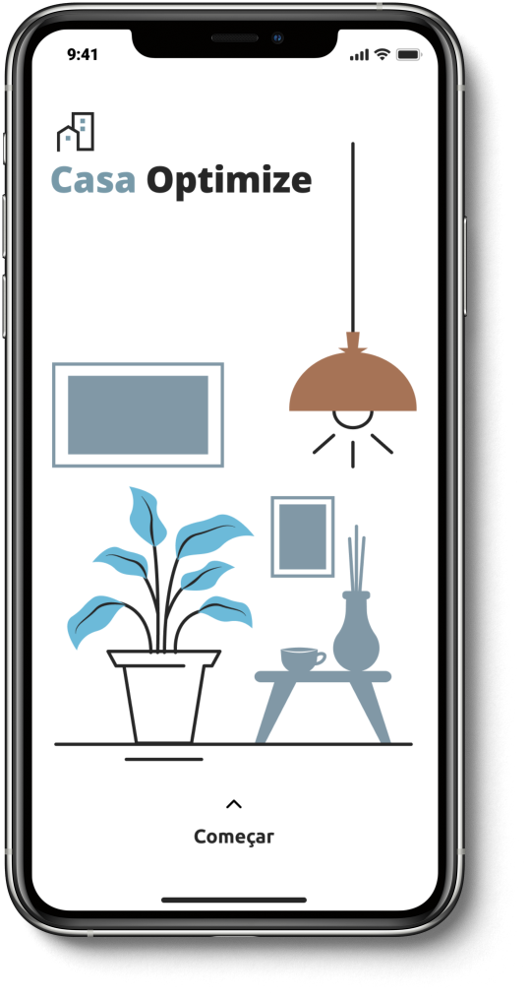

<p align="center">
   
</p>

<p align="center">	
  
  

  <a aria-label="Completed" href="https://hackathon.polinize.com/">
    </img>
  </a>
  <a href="https://github.com/bkkater/casa-optimize/commits/master">
    
  </a> 
  
</p>

Aplicativo que utiliza inteligência artificial proporcionando uma experiência personalizada ao consumidor, auxiliando na tomada de decisão durante a hora de comprar móveis ou itens de decoração para sua casa e disponibilizando um catálogo de produtos.

<div align="center">
  <sub>Built by
    <a href="https://github.com/Casa-Optmize">Casa Optmize</a>
  </sub>
</div>

# :pushpin: Tabela de Conteúdo

* [Tecnologias](#computer-tecnologias)
* [Funcionalidades](#rocket-funcionalidades)
* [Repositórios](#computer-Repositórios)
* [Como rodar](#construction_worker-como-rodar)
* [Equipe](#equipe)
* [License](#closed_book-license)
* [Equipe](#bulb-Equipe)


## 📥 Layout disponivel em:  
<p align="center">
    <a title=".fig Mobile" href="https://www.figma.com/file/COuTfekgKpb2bBdkCH9gVe/Casa-Optimize?node-id=0%3A1">
        
    </a>
</p>

### Mobile Screenshot
<div style="display: flex; flex-direction: 'row';">
   
</div>


# :computer: Tecnologias
Esse projeto foi feito utilizando as seguintes tecnologias:
<details>
  <summary>Mobile</summary>

-   [React](https://pt-br.reactjs.org/)
-   [React Native](https://reactnative.dev/)
-   [Expo](https://expo.io/learn)
-   [Typescript](https://www.typescriptlang.org/)
-   [React Native Paper](https://reactnativepaper.com/)
-   [React Navigation](https://reactnavigation.org/)
-   [Axios](https://www.npmjs.com/package/axios)
-   [Expo Google Fonts](https://github.com/expo/google-fonts)
-   [VS Code](https://code.visualstudio.com/)

</details>

# :rocket: Funcionalidades

- A Inteligência artificial identifica o perfil do cliente de acordo com: Dados de Clientes X Dados de Interesses X Dados Comportamentais. E Faz recomendações de produtos que atendem o interesse do usuário.

- Tecnologia 3D com experiência “LEGO” onde o cliente pode montar seu ambiente em tempo real pelo aplicativo criando um melhor contexto possível dentro de sua realidade de estilo-financeira.


# :computer: Repositórios
-   [IA](https://github.com/Casa-Optmize/CO_IA)
-   [API](https://github.com/Casa-Optmize/api)

# :construction_worker: Como rodar
```bash
# Clone o Repositório
$ git clone https://github.com/bkkater/casa-optimize.git
```

### 📱 Run Mobile Project
Para rodar o projeto mobile você precisa de um celular com o [expo](https://play.google.com/store/apps/details?id=host.exp.exponent) instlado ou um emulador android/ios.

```bash
# Vá para a pasta casa-optimize
$ cd casa-optimize
# Instale as depedencias
$ yarn install
# Rode a aplicação
$ yarn start
```
Depois leia o QRCode com o app do [expo](https://play.google.com/store/apps/details?id=host.exp.exponent) ou rode em um emulador.

# :bulb: Equipe
- [Bianca](https://github.com/bkkater)
- [Paulo](https://www.linkedin.com/in/paulodocarmo/)
- [Gabriel](https://www.linkedin.com/in/dev-gabriel-mendes/)
- [Rafael](https://www.linkedin.com/in/rafaelbo/)
- [Thainá](https://www.linkedin.com/in/thaina-monteiro/)

# :closed_book: LICENSE

Esse projeto está sobre [MIT license](./LICENSE).
